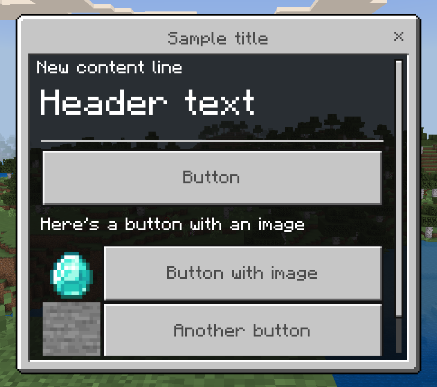
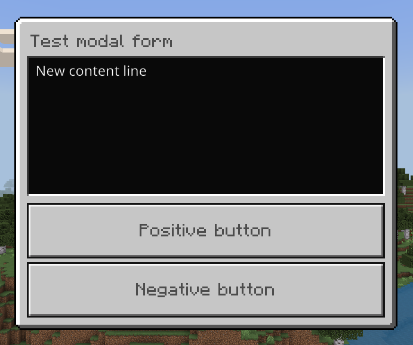
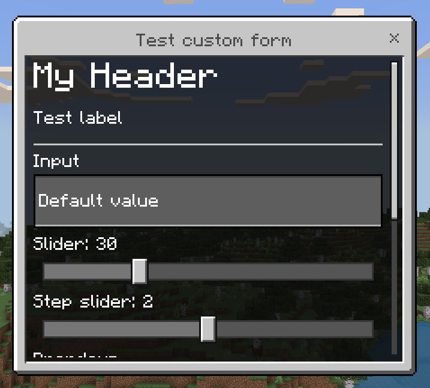
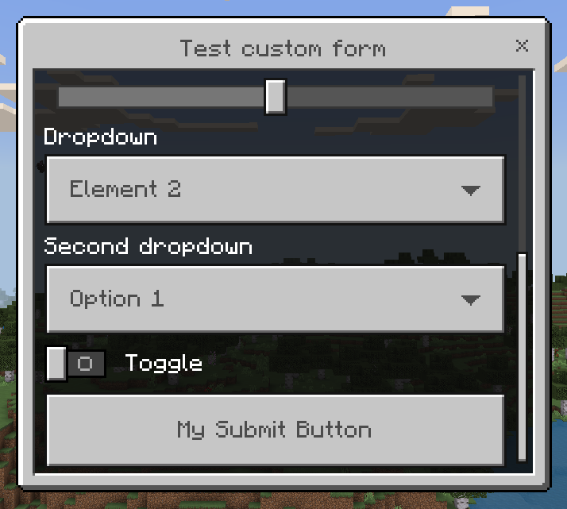

[](LICENSE)
[](https://github.com/MEFRREEX/FormConstructor/releases/tag/2.0.1)
[](https://jitpack.io/#MEFRREEX/FormConstructor)
[](https://cloudburstmc.org/resources/formconstructor-v2.957)

> [!IMPORTANT]
> Verstion 3.0.0 is no longer compatible with 2.0.x. If you need older version use:  
> https://github.com/MEFRREEX/FormConstructor/tree/legacy-2.0.0

# 🤔 Introduction

Library is designed to simplify the creation and handling of forms.
It has a few key advantages over other form libraries:

- Forms are handled using a lambda that is passed in when the form itself is created, and not by catching events.
- For each button in SimpleForm, we can set a handler.
- In SimpleForm we get a button object as a response, where we can get its name and index.
- In CustomForm we can mark elements with an identifier to conveniently get this element in its handler. We can get element by id and its index.
- For each form we can set its closing handler.
- Easy async handling.
- Dynamic form update.

## 🛠 Examples

Creating a SimpleForm:

```java
SimpleForm form = new SimpleForm("Sample title");
// Adding form content
form.addContent("New content line");
    
// Easiest way to add a button
form.addHeader("Header text")
    .addDivider()
    .addButton("Button", (pl, b) -> {
        pl.sendMessage("Button clicked: " + b.getName());
    })
    .addLabel("Here's a button with an image")
    // Button with image
    .addButton("Button with image", ImageType.PATH, "textures/items/diamond")
    // Another way to add a button
    .addButton(new Button("Another button")
        .setImage(ImageType.PATH, "textures/blocks/stone")
        .onClick((pl, b) -> {
            pl.sendMessage("Another button clicked: " + b.getName());
        }))
    .addLabel("Yes, we can add labels anywhere!");

// Setting the form close handler
form.setCloseHandler(pl -> {
    pl.sendMessage("You closed the form!");
});

form.send(player);
```
<div align="center">
  
</div>

Creating a ModalForm:

```java
ModalForm form = new ModalForm("Test modal form");
form.addContent("New content line");

form.setPositiveButton("Positive button")
    .setNegativeButton("Negative button");

// Setting the form handler
// Result returns true if a positive button was ckicked and false if a negative button was ckicked
form.setHandler((pl, result) -> {
    pl.sendMessage("You clicked " + (result ? "correct" : "wrong") + " button!");
});

// Setting the form close reason handler
form.setCloseHandler((pl, reason) -> {
    pl.sendMessage("You closed the form with reason " + reason);
});
        
form.send(player);
```
<div align="center">
  
</div>

Creating a CustomForm:

```java
CustomForm form = new CustomForm("Test custom form");

// Options list 
List<SelectableElement> elements = List.of(
    new SelectableElement("Option 1"),
    new SelectableElement("Option 2"),
    // SelectableElement may be named and may contain a value
    new SelectableElement("Option with value", 15)
);

form.addElement(new Header("My Header"))
    .addElement("Test label")
    .addElement(new Divider())
    .addElement("input", new Input("Input")
        .setPlaceholder("Text")
        .setDefaultValue("Default value"))
    .addElement("slider", new Slider("Slider", 1f, 100f, 1, 1))
    .addElement("stepslider", new StepSlider("Step slider")
        .addStep("1")
        .addStep("2")
        .addStep("3"))
    .addElement("dropdown", new Dropdown("Dropdown")
        .addElement("Element 1")
        .addElement("Element 2")
        .addElement("Element 3"))
    .addElement("dropdown1", new Dropdown("Second dropdown", elements))
    .addElement("toggle", new Toggle("Toggle"));

// Set the text of the submit button
// You can also set the key from the resource pack to this button
form.setSubmitButton("My Submit Button"); 

// Setting the form handler
form.setHandler((pl, response) -> {
    String input = response.getInput("input").getValue();

    float slider = response.getSlider("slider").getValue();
    SelectableElement stepslider = response.getStepSlider("stepslider").getValue();
    SelectableElement dropdown = response.getDropdown("dropdown").getValue();

    // Getting the value we set in SelectableElement
    Integer dropdownValue = response.getDropdown("dropdown1").getValue().getValue(Integer.class);

    boolean toggle = response.getToggle("toggle").getValue();

    pl.sendMessage("Input: " + input + ", Slider: " + slider + ", Step Slider: " + stepslider + ", Dropdown: " + dropdown + ", Toggle: " + toggle);
    pl.sendMessage("Second dropdown value: " + dropdownValue);
});

form.send(player);
```
<div align="center">
  
  
</div>

Creating an updatable form:

```java
SimpleForm form = new SimpleForm("Sample title");

AtomicInteger counter = new AtomicInteger();

// For example, let's create a task that will increment the counter by 1 every second
Server.getInstance().getScheduler().scheduleRepeatingTask(() -> {
    form.setContent("Count is " + counter.get()); // Set form content
    form.sendUpdate(player); // Send a form update
    counter.getAndIncrement();
}, 20);

form.send(player);
```
Note, this works with any type and content of form.

### Async handling
Also you can use method `sendAsync(player)` or `send(player, true)` for using async form handling.

## 📋 Events
| Name                 | Cancellable | Description                      |
|----------------------|-------------|----------------------------------|
| PlayerFormSendEvent  | true        | Called when a form is sent       |
| PlayerFormCloseEvent | false       | Called when the form is closed   |

Example:
```java
@EventHandler
public void onFormSend(PlayerFormSendEvent event) {
    // Getting a player
    Player player = event.getPlayer();
    // Getting the form
    Form form = event.getForm();
}
```

## 🔌 Installation
Place the plugin of the appropriate version in the `plugins` folder.

### Maven

Repository:
```xml
<repositories>
    <repository>
        <id>jitpack.io</id>
        <url>https://jitpack.io</url>
    </repository>
</repositories>
```

Dependency
```xml
<dependency>
    <groupId>com.github.MEFRREEX</groupId>
    <artifactId>FormConstructor</artifactId>
    <version>TAG</version>
</dependency>
```

### Gradle

Repository:
```groovy
repositories {
    mavenCentral()
    maven { url 'https://jitpack.io' }
}
```
Dependency:
```groovy
dependencies {
    implementation 'com.github.MEFRREEX:FormConstructor:TAG'
}
